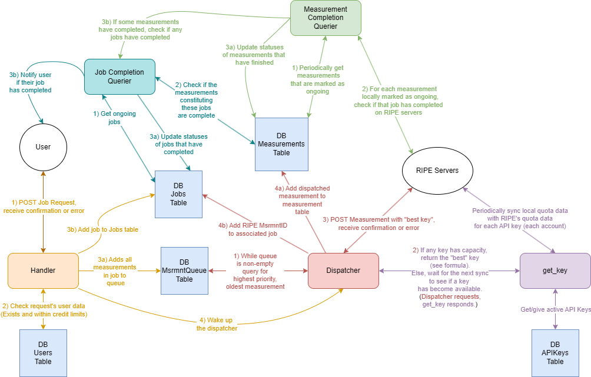

## Overview
The platform consists of two main services, being the scheduling service and the results service. These two services are further broken down into a few smaller microservices: the handler, dispatcher, and get_key microservices compose the scheduling service, and the measurement_completion_querier and job_completion_querier compose the get_results service. A SQLite3 database works alongside these microservices to complete the meat of the backend.

This diagram depicts the lifecycle of a job and its constituent measurements. 

Here is a more detailed description of each microservice and its role in the lifecycle of a job.

## Scheduling side:
### Handler:
1) A user POSTs a request to the handler, as outlined in the end-user documentation.
2) The handler verifies that this request comes from a valid user, performs a schema validation on the data, calculates the hypothetical credit usage of the job, and verifies that the job wouldn't put the user over their daily credit spending limit.
3) If the above conditions are all met, the handler inserts a new job in the "Jobs" table of the database, and then parses the individual measurements from the submitted job request and enters each one into the "MsrmntQueue" table of the database. Finally, the handler alerts the dispatcher that there are new measurements in the queue.
### Dispatcher and get_key:
- Notes:
	- The dispatcher operates on a measurement-by-measurement basis instead of concurrently in order to respect RIPE's servers and bring scheduling speeds in line with Cousteau and GOAT.
	- The API keys are pulled from the database only upon service startup, so if you modify the "active" column of the "APIKeys" table, you will need to restart the scheduling service for these to changes to take effect on the platform.
1) While the "MsrmntQueue" table is non-empty, the dispatcher processes measurements one-by-one. The dispatcher parses the relevant information for calculating the anticipated credit expenditure of the measurement it is trying to schedule (type and # of probes), and then sends that information to the get_key service in a GET request to get an API key to use for the measurement that is currently being processed.
2) The get_key service maintains a local data structure containing the relevant quota data for each API key within use (current measurements, daily credits spent, and daily results), and then uses some simple logic to spread usage between these keys evenly.
	1) After returning a key to the dispatcher, the get_key service updates the local data structure to reflect the usage of this key for the upcoming measurement. The get_key service syncs with the RIPE quota data after 30 seconds of no requests being made to it. That is, after 30 seconds of no get_key requests, the local quota data structure is overridden with "fresh" data from RIPE. Initially this sync occurred every 30 seconds no matter what, but syncs that happened while measurements were actively being scheduled resulted in RIPE quota data not yet reflecting the recently scheduled measurements and thus under-counting the quota data.
	2) In the event that all keys are at capacity, the dispatcher starts a 30.1 second timer. Every time that this timer expires, it makes a new request to get_key to see if a key has become available. In the background, the get_key service is periodically (every 30 seconds) refreshing its quota data with the "fresh" data from RIPE. Once some measurements complete and the RIPE quotas reflect this, the dispatching processes begins again until the keys are once again at capacity or the queue is empty.
3) The dispatcher then uses this API key to schedule the measurement on RIPE. RIPE responds with a unique measurement ID. The dispatcher takes this measurement ID and combines it with a new timestamp and information about the measurement that was pulled from the MsrmntQueue table to create a measurement in the "Measurements" table, and then adds the measurement ID to the "MsrmntIDs" column in the "Jobs" table for the job of which this measurement is a part of.

## Results Side:

### measurement_completion_querier:
- This service cross-checks the measurements that we have as ongoing locally and the measurements that are actually still ongoing on RIPE. If there are measurements that we have marked as ongoing locally but aren't ongoing on RIPE, we update those measurements to be completed locally, and then call the job_completion_querier. This cross-check and update is performed upon service startup and then every 30-seconds following that.

### job_completion_querier:
- This service gets the ongoing jobs in the jobs database, and then checks if all of the measurements constituting this job are completed (in the measurements table). If they all are completed, the job's status is marked as completed. This check runs upon service startup and after the measurement_completion_querier updates a batch of measurements. It will run at most once every 30 seconds.
