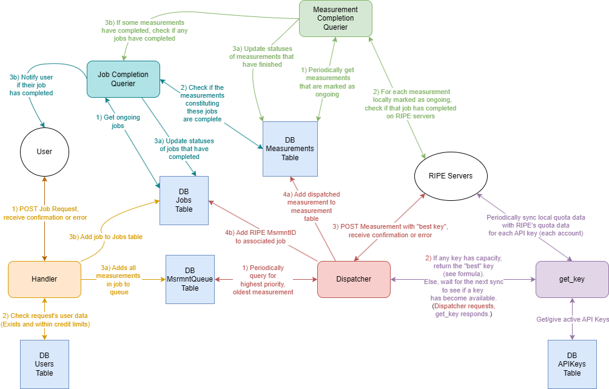

The platform consists of two main services, being the scheduling service and the get_results service. These two services are further broken down into a few smaller microservices: the handler, dispatcher, and get_key microservices compose the scheduling service, and the measurement_completion_querier and job_completion_querier compose the get_results service. A SQLite3 database works alongside these microservices to complete the meat of the backend.

This diagram depicts the lifecycle of a job and its constituent measurements. 

For clarity, here is the lifecycle of a job in text form.

Scheduling:
1) A user POSTs a request to the handler, as outlined in the end-user documentation.
2) The handler verifies that this request comes from a valid user, performs a schema validation on the data, calculates the hypothetical credit usage of the job, and verifies that the job wouldn't put the user over their daily credit spending limit.
3) If the above conditions are all met, the handler inserts a new job in the "Jobs" table of the database, and then parses the individual measurements from the submitted job request and enters each one into the "MsrmntQueue" table of the database.
4) Every 30 seconds, the 